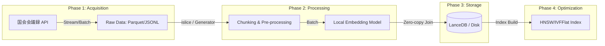

# RAG Primitive Architecture Design (STEP 1)

このドキュメントは、国会会議録 API からデータを取得し、LanceDB へ格納するまでの「理論的設計」を整理するためのものである。
「ただ動く」コードではなく、1,000万件、1億件へとスケールさせるためのシニア・データアーキテクトとしての視点を記述せよ。  
https://kokkai.ndl.go.jp/#/detail?minId=122104339X00320260312&current=1
---

## 1. 全体アーキテクチャ（System Architecture Overview）

データのライフサイクルを以下の 4 つのフェーズに分離する。

---

## 2. データ取得（Data Acquisition）の戦略
- **ソース**: 国会会議録検索システム API。
- **取得パイプライン**: 2-Stage Pipeline（API -> Raw Data Lake）を採用。
    - **[Q] なぜ API から直接ベクトル化せず、一度ローカルに保存（Raw Data Lake）するのか？**:
    - **[A]**: **耐障害性（Resilience）**と**実験の再現性（Reproducibility）**を担保するため。
        1. **リトライ効率**: ネットワーク瞬断や API レート制限発生時、取得済みデータを保護し、未取得分のみを差分取得（Checkpointing）可能にする。
        2. **試行錯誤の高速化**: エンベッディングモデルの変更やチャンキング戦略の微調整（Hyperparameter Tuning）の際、高コストなネットワーク I/O を排除し、ローカル I/O のみで高速に再実験を回すため。
        3. **スキーマの進化（Schema Evolution）**: 後から「発言者の政党情報をフィルタリングに加えたい」等の要件が出た際、API を叩き直さずに Raw データからメタデータを再抽出するため。
- **データ構造の階層化**:
    - `Meeting` ＞ `Speech` ＞ `Chunk`
    - **[Q] 数万文字を超える「極端に長い発言（Outlier）」に対するガードレール設計は？**:
    - **[A]**: **再帰的チャンキング（Recursive Chunking）**と**メモリバッファの制限**で対応。
        1. **モデル制約**: 多くのローカルモデル（BERT系）は 512 トークン程度の入力制限がある。長文は意味の切れ目（句読点等）で分割し、複数のベクトルとして管理する。
        2. **空間計算量（OOM 対策）**: 1 発言を丸ごとメモリに載せず、ストリーミングで読み込み、一定サイズ（例: 2000文字）ごとにチャンク化してベクトル変換へ流すことで、最悪ケースのメモリ消費量を $O(1)$（定数倍）に抑える。

## 3. データパイプライン（Data Processing & Embedding）
### 「入力側で Polars を使わない」論理的根拠
データ分析の天才である Polars を、本フェーズの「エサやり」に採用しない理由は以下の 3 点にある。

1. **空間計算量 $O(1)$ の死守**: `pl.read_parquet()` は全データをメモリにロードしようとする。本システムでは Python 標準の `itertools.islice` とジェネレータを用い、一度にメモリに載るデータ量を「バッチサイズ（例: 64件）」に固定し、定数倍のメモリ消費に抑える。
2. **メモリ2重持ち（Double Buffering）の回避**: Polars (Rust/Arrow) からデータを抜き出す際（`.to_list()`）、Python オブジェクトへのフルコピーが発生する。これを避けるため、最初から Python の軽量な文字列としてストリーミング供給する。
3. **計算エンジンのミスマッチ**: NLP（チャンキング/トークナイズ）は CPU、推論は GPU の仕事である。

## 4. 効率化とゼロコピー（Zero-copy Efficiency）
### 「ガッチャンコ（Column Join）」のデータフロー
メタデータ（文字列）とベクトル（数値配列）を、メモリコピーを最小限に抑えて LanceDB へ格納する。

- **Zero-copy 手順**:
    1. **Vector**: `torch.Tensor` -> `.numpy()` (Shared Memory) -> `pyarrow.FixedSizeListArray` (Wrap)。
    2. **Metadata**: Python List (Batch) -> `pyarrow.array()`。
    3. **Join**: `pyarrow.RecordBatch.from_arrays` を用い、メタデータ列とベクトル列を一つのバッチに結合。

## 5. 信頼性と耐久性（Reliability & Durability）
### べき等性（Idempotency）とチェックポイント
- **Content-based Addressing**: 各チャンクの「元データID + チャンク番号 + 内容のMD5ハッシュ」を `id` として生成する。
- **Upsert 戦略**: LanceDB の書き込み時に、この `id` をキーとして既存データを確認。再実行時の重複を排除する。

## 6. ベンチマーク指標（Benchmarking Strategy）
- **計測対象**: Latency (ms/query), Throughput (docs/sec), Recall (%), Memory Usage (MiB)。
- **比較対象**: IVFFlat vs HNSW。それぞれのインデックス構築コストと検索性能のトレードオフを定量化する。

---

## 7. シニア・アーキテクトによる批判的検討（Critical Deep Dives）
1億件スケールのシステムにおいて、机上の空論を排除するための厳格な検証項目。

### 7.1. 真の空間計算量と「隠れたメモリ」
- **[Q] 2000文字×64バッチならメモリ消費は無視できるか？**:
- **[A]**: **否。** 文字列そのもののサイズ（約256KB）は氷山の一角である。
    1. **Tokenizer Overhead**: 文字列をモデル入力用の Tensor に変換した際、`int64` 型の ID 配列や Attention Mask が生成される。512 トークン × 64 バッチ × 8 バイト (int64) = 約 256KB だが、PyTorch 内部のテンソル管理やバッファ、CUDA コンテキストの初期化で数百 MiB 単位の「固定費」が発生する。
    2. **Python Object Overhead**: Python の `list` はポインタの配列であり、各文字列オブジェクトもオーバーヘッドを持つ。1億件を扱う際、この「小さな積み重ね」が $O(N)$ で効いてこないか、ジェネレータの境界条件を厳密に管理する必要がある。

### 7.2. バッチサイズ（Batch Size）の論理的最適化
- **[Q] なぜバッチサイズは「64」なのか？**:
- **[A]**: **スループット（Throughput）とレイテンシ（Latency）のトレードオフ**である。
    - **スループット優先（Batch 256+）**: GPU の並列演算ユニット（CUDA Core / Tensor Core）を使い切るため、大きなバッチを組む。ただし、GPU VRAM への転送待ち（I/O Bound）が発生し、1バッチあたりの処理時間は長くなる。
    - **レイテンシ優先（Batch 1-8）**: リアルタイム性は高いが、GPU の利用効率が悪く、1億件の処理完了（Total Job Completion Time）が絶望的に遅くなる。
    - **最適解**: ローカルの GPU/MPS メモリ帯域と演算性能を計測し、VRAM 使用率が 70-80% に収まる「スイートスポット」を実験的に決定する。

### 7.3. 分散システムとしての「背圧（Backpressure）」制御
- **[Q] データの供給（API/Disk）と消費（GPU）の速度差をどう制御するか？**:
- **[A]**: **Python Generator による Implicit Backpressure** を活用。
    - 本システムは PUSH 型（API からどんどん送る）ではなく **PULL 型（モデルが要求した時だけ次を読み込む）** である。
    - ジェネレータ（`yield`）を用いることで、前段の処理が完了するまで後段の読み込みが発生しないため、メモリ上に未処理データが滞留して $O(N)$ で膨らむリスクを自然に回避できる。

### 7.4. 1億件スケールでの LanceDB インデックス構築
- **[Q] 1億件のベクトルを HNSW でインデックス構築できるか？**:
- **[A]**: **メモリ消費が最大の懸念。** HNSW は全ノードのグラフ構造をメモリに保持する。
    - 1億件 × 512次元 × 4バイト (float32) = 約 200GB の生データに加え、グラフのエッジ情報が必要。
    - 解決策として、LanceDB の **IVF-PQ (Product Quantization)** 等を用い、ベクトルを量子化してメモリ消費を 1/10 以下に圧縮する戦略を検討。

### 7.5. なぜ JSON ではなく JSONL を採用するのか
- **[Q] Data Lake のフォーマットとして JSONL を選ぶ論理的根拠は？**:
- **[A]**: **空間計算量 $O(1)$ の担保と耐障害性**にある。
    1. **Streaming Friendly**: 通常の JSON 配列はファイル全体をメモリにロードしてパースする必要があるが、JSONL (JSON Lines) は `readline()` で 1 行ずつ（1 会議録ずつ）処理可能。これにより、テラバイト級の Data Lake でもメモリ消費を一定に保てる。
    2. **Atomic Append**: ファイルの末尾に 1 行追記するだけでデータが確定する。途中でクラッシュしても、それまでに書き込んだ行は有効な JSON として残り、壊れた `]` 閉じを気にする必要がない。
    3. **Schema Evolution**: 行ごとに異なるメタデータを持っていてもパース可能であり、将来的なスキーマ変更に強い。

### 7.6. 1億件に向けたチェックポインティング（Checkpointing）戦略
- **[Q] 長期間のクローリングで「どこまで取ったか」をどう管理するか？**:
- **[A]**: 規模に応じて以下の 3 段階の戦略を使い分ける。
    1. **Idempotent Scan (小〜中規模)**: 保存先ディレクトリに `issue_id.jsonl` が存在するかを `exists()` で確認。DB 不要でシンプルだが、ファイル数が数百万を超えると `ls` がボトルネックになる。
    2. **State DB (大規模・推奨)**: SQLite や Redis 等に `issue_id` と `status` (PENDING, SUCCESS, FAILED) を記録。取得済みデータの検索が $O(1)$ または $O(\log N)$ で完了し、失敗した ID のみのリトライが容易。
    3. **Sharded Storage**: 1 つのディレクトリに大量のファイルを置かず、ID のハッシュ値等でディレクトリを階層化（例: `data/raw/ab/cd/issue_id.jsonl`）し、ファイルシステムの inode 制限やパフォーマンス劣化を回避する。
