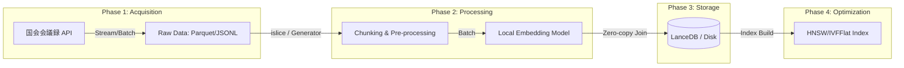
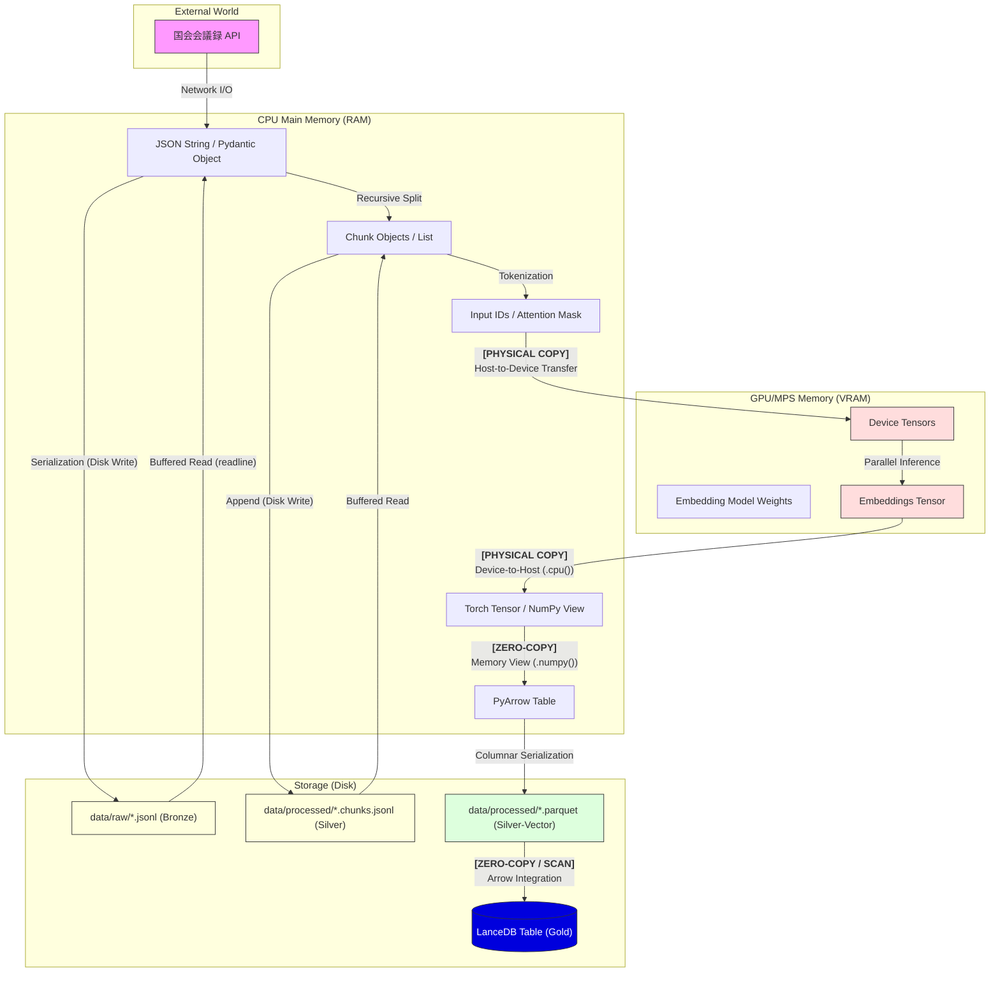
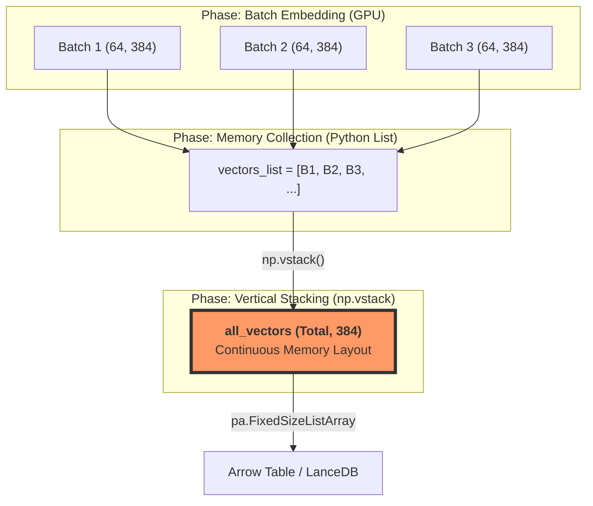

# RAG Primitive Architecture Design (STEP 1)

このドキュメントは、国会会議録 API からデータを取得し、LanceDB へ格納するまでの「理論的設計」を整理するためのものである。
「ただ動く」コードではなく、1,000万件、1億件へとスケールさせるためのシニア・データアーキテクトとしての視点を記述せよ。  
https://kokkai.ndl.go.jp/#/detail?minId=122104339X00320260312&current=1
---

## 1. 全体アーキテクチャ（System Architecture Overview）

データのライフサイクルを以下の 4 つのフェーズに分離する。

---

## 2. データ取得（Data Acquisition）の戦略
- **ソース**: 国会会議録検索システム API。
- **取得パイプライン**: 2-Stage Pipeline（API -> Raw Data Lake）を採用。
    - **[Q] なぜ API から直接ベクトル化せず、一度ローカルに保存（Raw Data Lake）するのか？**:
    - **[A]**: **耐障害性（Resilience）**と**実験の再現性（Reproducibility）**を担保するため。
        1. **リトライ効率**: ネットワーク瞬断や API レート制限発生時、取得済みデータを保護し、未取得分のみを差分取得（Checkpointing）可能にする。
        2. **試行錯誤の高速化**: エンベッディングモデルの変更やチャンキング戦略の微調整（Hyperparameter Tuning）の際、高コストなネットワーク I/O を排除し、ローカル I/O のみで高速に再実験を回すため。
        3. **スキーマの進化（Schema Evolution）**: 後から「発言者の政党情報をフィルタリングに加えたい」等の要件が出た際、API を叩き直さずに Raw データからメタデータを再抽出するため。
- **データ構造の階層化**:
    - `Meeting` ＞ `Speech` ＞ `Chunk`
    - **[Q] 数万文字を超える「極端に長い発言（Outlier）」に対するガードレール設計は？**:
    - **[A]**: **再帰的チャンキング（Recursive Chunking）**と**メモリバッファの制限**で対応。
        1. **モデル制約**: 多くのローカルモデル（BERT系）は 512 トークン程度の入力制限がある。長文は意味の切れ目（句読点等）で分割し、複数のベクトルとして管理する。
        2. **空間計算量（OOM 対策）**: 1 発言を丸ごとメモリに載せず、ストリーミングで読み込み、一定サイズ（例: 2000文字）ごとにチャンク化してベクトル変換へ流すことで、最悪ケースのメモリ消費量を $O(1)$（定数倍）に抑える。

## 3. データパイプライン（Data Processing & Embedding）
### 「入力側で Polars を使わない」論理的根拠
データ分析の天才である Polars を、本フェーズの「エサやり」に採用しない理由は以下の 3 点にある。

1. **空間計算量 $O(1)$ の死守**: `pl.read_parquet()` は全データをメモリにロードしようとする。本システムでは Python 標準の `itertools.islice` とジェネレータを用い、一度にメモリに載るデータ量を「バッチサイズ（例: 64件）」に固定し、定数倍のメモリ消費に抑える。
2. **メモリ2重持ち（Double Buffering）の回避**: Polars (Rust/Arrow) からデータを抜き出す際（`.to_list()`）、Python オブジェクトへのフルコピーが発生する。これを避けるため、最初から Python の軽量な文字列としてストリーミング供給する。
3. **計算エンジンのミスマッチ**: NLP（チャンキング/トークナイズ）は CPU、推論は GPU の仕事である。

## 4. 効率化とゼロコピー（Zero-copy Efficiency）
### 「ガッチャンコ（Column Join）」のデータフロー
メタデータ（文字列）とベクトル（数値配列）を、メモリコピーを最小限に抑えて LanceDB へ格納する。

- **Zero-copy 手順**:
    1. **Vector**: `torch.Tensor` -> `.numpy()` (Shared Memory) -> `pyarrow.FixedSizeListArray` (Wrap)。
    2. **Metadata**: Python List (Batch) -> `pyarrow.array()`。
    3. **Join**: `pyarrow.RecordBatch.from_arrays` を用い、メタデータ列とベクトル列を一つのバッチに結合。

## 5. 信頼性と耐久性（Reliability & Durability）
### べき等性（Idempotency）とチェックポイント
- **Content-based Addressing**: 各チャンクの「元データID + チャンク番号 + 内容のMD5ハッシュ」を `id` として生成する。
- **Upsert 戦略**: LanceDB の書き込み時に、この `id` をキーとして既存データを確認。再実行時の重複を排除する。

## 6. ベンチマーク指標（Benchmarking Strategy）
- **計測対象**: Latency (ms/query), Throughput (docs/sec), Recall (%), Memory Usage (MiB)。
- **比較対象**: IVFFlat vs HNSW。それぞれのインデックス構築コストと検索性能のトレードオフを定量化する。

---

## 7. シニア・アーキテクトによる批判的検討（Critical Deep Dives）
1億件スケールのシステムにおいて、机上の空論を排除するための厳格な検証項目。

### 7.1. 真の空間計算量と「隠れたメモリ」
- **[Q] 2000文字×64バッチならメモリ消費は無視できるか？**:
- **[A]**: **否。** 文字列そのもののサイズ（約256KB）は氷山の一角である。
    1. **Tokenizer Overhead**: 文字列をモデル入力用の Tensor に変換した際、`int64` 型の ID 配列や Attention Mask が生成される。512 トークン × 64 バッチ × 8 バイト (int64) = 約 256KB だが、PyTorch 内部のテンソル管理やバッファ、CUDA コンテキストの初期化で数百 MiB 単位の「固定費」が発生する。
    2. **Python Object Overhead**: Python の `list` はポインタの配列であり、各文字列オブジェクトもオーバーヘッドを持つ。1億件を扱う際、この「小さな積み重ね」が $O(N)$ で効いてこないか、ジェネレータの境界条件を厳密に管理する必要がある。

### 7.2. バッチサイズ（Batch Size）の論理的最適化
- **[Q] なぜバッチサイズは「64」なのか？**:
- **[A]**: **スループット（Throughput）とレイテンシ（Latency）のトレードオフ**である。
    - **スループット優先（Batch 256+）**: GPU の並列演算ユニット（CUDA Core / Tensor Core）を使い切るため、大きなバッチを組む。ただし、GPU VRAM への転送待ち（I/O Bound）が発生し、1バッチあたりの処理時間は長くなる。
    - **レイテンシ優先（Batch 1-8）**: リアルタイム性は高いが、GPU の利用効率が悪く、1億件の処理完了（Total Job Completion Time）が絶望的に遅くなる。
    - **最適解**: ローカルの GPU/MPS メモリ帯域と演算性能を計測し、VRAM 使用率が 70-80% に収まる「スイートスポット」を実験的に決定する。

### 7.3. 分散システムとしての「背圧（Backpressure）」制御
- **[Q] データの供給（API/Disk）と消費（GPU）の速度差をどう制御するか？**:
- **[A]**: **Python Generator による Implicit Backpressure** を活用。
    - 本システムは PUSH 型（API からどんどん送る）ではなく **PULL 型（モデルが要求した時だけ次を読み込む）** である。
    - ジェネレータ（`yield`）を用いることで、前段の処理が完了するまで後段の読み込みが発生しないため、メモリ上に未処理データが滞留して $O(N)$ で膨らむリスクを自然に回避できる。

### 7.4. 1億件スケールでの LanceDB インデックス構築
- **[Q] 1億件のベクトルを HNSW でインデックス構築できるか？**:
- **[A]**: **メモリ消費が最大の懸念。** HNSW は全ノードのグラフ構造をメモリに保持する。
    - 1億件 × 512次元 × 4バイト (float32) = 約 200GB の生データに加え、グラフのエッジ情報が必要。
    - 解決策として、LanceDB の **IVF-PQ (Product Quantization)** 等を用い、ベクトルを量子化してメモリ消費を 1/10 以下に圧縮する戦略を検討。

### 7.5. なぜ JSON ではなく JSONL を採用するのか
- **[Q] Data Lake のフォーマットとして JSONL を選ぶ論理的根拠は？**:
- **[A]**: **空間計算量 $O(1)$ の担保と耐障害性（データ保護）**にある。
    1. **Streaming Friendly (標準ライブラリの制約)**: 通常の JSON 配列（`[...]`）をパースする場合、Python 標準の `json` ライブラリはファイル全体を一度メモリにロードして木構造を構築する必要がある。100GB の JSON は 100GB 以上のメモリを要求するが、JSONL (JSON Lines) は `readline()` で 1 行ずつ（1 会議録ずつ）独立してパース可能なため、テラバイト級のデータでもメモリ消費を一定（レコードサイズ依存）に保てる。
    2. **Atomic Append (破壊的更新の回避)**: JSON 配列に要素を追加するには、物理的には末尾の `]` を削除し、`,` と新しい要素を書き込み、再度 `]` を閉じる「書き換え」作業が発生する。この処理中にシステムがクラッシュした場合、ファイル全体がパース不能な「不正な JSON」となり、過去の全データが消失するリスクがある。一方、JSONL は単なる EOF への「行追記」であり、追記中に失敗しても「それ以前の行」は完全に有効な JSON として保護される。
    3. **Small File Problem の回避と集約**: 1億件のデータを 1 レコード 1 ファイルで保存すると `inode` の枯渇を招くため、通常は数百 MB 単位に集約する。JSONL はこの集約が「行の結合」だけで完結し、かつ分散処理（Spark/Snowflake等）での並列読み込みにおいて最強の親和性を持つ。
    4. **Schema Evolution**: 行ごとに異なるメタデータを持っていてもパース可能であり、将来的なスキーマ変更に強い。

### 7.6. 1億件に向けたチェックポインティング（Checkpointing）戦略
- **[Q] 長期間のクローリングで「どこまで取ったか」をどう管理するか？**:
- **[A]**: 規模に応じて以下の 3 段階の戦略を使い分ける。
    1. **Idempotent Scan (小〜中規模)**: 保存先ディレクトリに `issue_id.jsonl` が存在するかを `exists()` で確認。DB 不要でシンプルだが、ファイル数が数百万を超えると `ls` がボトルネックになる。
    2. **State DB (大規模・推奨)**: SQLite や Redis 等に `issue_id` と `status` (PENDING, SUCCESS, FAILED) を記録。取得済みデータの検索が $O(1)$ または $O(\log N)$ で完了し、失敗した ID のみのリトライが容易。
    3. **Sharded Storage**: 1 つのディレクトリに大量のファイルを置かず、ID のハッシュ値等でディレクトリを階層化（例: `data/raw/ab/cd/issue_id.jsonl`）し、ファイルシステムの inode 制限やパフォーマンス劣化を回避する。

### 7.7. 日本語 RAG におけるチャンキング戦略とスケール
- **[Q] なぜセマンティック（Semantic）ではなく再帰的（Recursive）チャンキングなのか？**:
- **[A]**: **計算スループットと精度のトレードオフ（Cost-Effectiveness）**による。
    1. **スループットの死守**: セマンティック・チャンキングは「切れ目」を探すために Embedding モデルの推論を必要とする。1億件の処理において、ベクトル化（Phase 2）の前にさらに推論コストをかけるのは非効率。CPU による文字列操作（$O(1)$）で完結する再帰的チャンキングの方が圧倒的にスループットが高い。
    2. **日本語の構造的特性**: `["\n\n", "\n", "。", "、", " ", ""]` の順にセパレータを試行する再帰的アプローチにより、文脈（文末の「。」など）を維持しつつ、モデルのトークン制限（512等）に収めることが可能。
    3. **階層型（Hierarchical）への拡張性**: まずは再帰的チャンキングで「小さなチャンク」を作り、必要に応じてその「親（発言全体や段落）」との紐付けを LanceDB のメタデータで行う方が、最初から複雑な階層構造を作るよりも開発速度と柔軟性に優れる。
    4. **オーバーラップ（Overlap）の重要性**: `chunk_size=2000`, `chunk_overlap=200` 等の設定により、チャンクの境界付近にある情報の欠落を防ぎ、検索時の再現率（Recall）を向上させる。

### 7.8. MD5 ハッシュによる Content-based Addressing とべき等性
- **[Q] なぜ Chunk ID に UUID ではなく MD5 ハッシュを採用するのか？**:
- **[A]**: **べき等性（Idempotency）の担保とデータリネージの追跡**のため.
    1. **Content-based Addressing**: `hash(issue_id + speech_id + chunk_text)` を ID とすることで、データの内容そのものがその一意識別子となる。これにより、同一内容のチャンクが重複してインデックスされるのを防ぐ。
    2. **Upsert（Update or Insert）の実現**: 1億件のクロール中にエラーが発生して再実行した際、DB 側に同一ハッシュが存在すればスキップ、あるいは更新するだけで済む。UUID のようなランダム ID では「内容が同じなのに ID が違う」二重登録（Duplicate Data）が発生し、RAG の検索精度（ノイズ混入）を著しく低下させる。
    3. **ハッシュ関数の選択（MD5 vs SHA-256）**: 本システムでは暗号学的な安全性ではなく「一意性と計算速度」を優先し、MD5 を採用。1億件規模のハッシュ計算において、SHA-256 よりも CPU 負荷を抑え、パイプラインのスループットを最大化する戦略をとる。
    4. **データリネージ**: ID そのものが「どの会議のどの発言のどの部分か」に紐付いているため、万が一データに不備が見つかった際、ID から元のソースデータを特定（Traceability）することが容易になる。

### 7.9. エンベッディング戦略：ローカルモデル vs クラウド API
- **[Q] なぜ OpenAI 等の外部 API ではなく、ローカルモデル（E5-small）を採用するのか？**:
- **[A]**: **コスト、スループット、およびデータプライバシーの最適化**のため。
    1. **圧倒的なコスト効率 (Cost at Scale)**: 1億件のチャンクを外部 API でベクトル化する場合、トークン課金により膨大なコストが発生する。ローカル GPU/MPS を活用することで、インフラ固定費のみでスループットを維持でき、大規模処理における限界費用をほぼゼロに抑えられる。
    2. **ネットワーク I/O の排除**: 外部 API は通信遅延、レート制限（429 Too Many Requests）、およびペイロード制限がボトルネックとなる。ローカル推論では VRAM との高速なデータ転送のみに依存するため、パイプライン全体のスループットをハードウェアの限界まで引き上げることが可能。
    3. **モデル選定の論理的根拠 (JMTEB 実績)**: 日本語ベンチマーク（JMTEB）で高スコアを記録している `intfloat/multilingual-e5-small` を採用。`query:` および `passage:` プレフィックスを用いる非対称検索への最適化と、パラメータ数の少なさによる推論速度の速さを両立している。
    4. **完全なデータプライバシー**: データを外部サーバーに送出することなく、ローカル環境内で全工程（取得、加工、ベクトル化、格納）を完遂できる。
    5. **再現性の担保**: 外部 API ではモデルのバージョン更新や廃止リスクがあるが、ローカルにモデル重みを固定することで、10年後でも同一のベクトル表現を生成できる一貫性を確保する。

### 7.10. メモリレイアウトと物理データフロー (CPU vs. GPU)
- **[Q] データは物理的にどこを通り、どこでコピーが発生しているか？**:
- **[A]**: **VRAM と RAM の境界を意識した「ゼロコピーへの執念」**を以下の図に示す。

1. **物理的コピー (Red-line)**: CPU (RAM) と GPU (VRAM) の間でのデータ転送。これはバス帯域を消費する最も高コストな操作であり、`BATCH_SIZE` の最適化によってこの転送オーバーヘッドを相対的に小さく抑える（計算密度の向上）戦略をとる。
2. **ゼロコピー / メモリ共有 (Green-line)**: CPU メモリ内での `Torch -> NumPy -> PyArrow` の遷移。実データ（バイト列）を複製せず、メタデータ（View）のみを書き換えることで、1億件スケールでのメモリパンクを回避する。
3. **LanceDB へのランディング**: LanceDB は内部で Apache Arrow 形式を採用しているため、Parquet (Arrow 互換) からの取り込みにおいて「ほぼコピーなし」の高速なロードが可能となる。

### 7.11. バッチ処理とメモリ常駐のトレードオフ
- **[Q] Phase 2-B において、なぜ全チャンクを一時的にメモリに保持（chunks.extend）しているのか？**:
- **[A]**: **「垂直立ち上げ（End-to-End）」の優先と「水平スケーラビリティ」への移行準備**のため。
    1. **単一ユニット（会議録）のメモリ許容範囲**: 現在のターゲットである「1つの会議録」単位では、チャンク数は数千件程度であり、ベクトル（384次元）を含めてもメモリ消費は数十 MiB 程度に収まる。プロトタイピング段階では、実装の単純化とデバッグの容易性を優先し、インメモリでテーブルを構築する。
    2. **1億件スケールでのストリーミング移行**: 1億件（約143GBのベクトル）をメモリに載せることは物理的に不可能である。本番スケールでは、`pq.ParquetWriter` や `lancedb.table.add()` をバッチループ内で呼び出し、書き込み完了後にメモリ（Buffer）を解放する **「ストリーミング書き出し」** に切り替える。
    3. **空間計算量 $O(B)$ の死守**: ストリーミング移行後は、全体のデータ量 $N$ に対わらず、メモリ消費はバッチサイズ $B$ にのみ依存する $O(B)$ となり、理論上無限のデータ量を一定のメモリリソースで処理可能となる。

### 7.12. LanceDB の Disk-First & Arrow-Native 哲学
- **[Q] なぜ Pinecone や Milvus ではなく LanceDB を選択するのか？**:
- **[A]**: **リソース限界を RAM ではなく Disk 物理容量まで拡張するため**である。
    1. **Arrow-Native によるゼロコピー**: LanceDB の内部フォーマットは Apache Arrow そのものである。Phase 2 で生成されたベクトルやメタデータは Arrow 互換であるため、DB 格納時のシリアライズ/デシリアライズ・オーバーヘッドが極小化され、1億件のロード時間を劇的に短縮できる。
    2. **Disk-First Architecture**: 多くのベクターDBが「高速化のために全データをメモリに載せる」ことを前提とする中、LanceDB は「データはディスクに置き、必要なサブセットを Arrow で高速スキャンする」設計を採用している。これにより、16GB 程度の RAM しか持たないコンシューマ機でも、1TB 以上のベクターデータを扱うことが可能になる。

### 7.13. 1億件スケールにおける IVF-PQ インデックスの必然性
- **[Q] なぜ HNSW ではなく IVF-PQ を検討するのか？**:
- **[A]**: **インデックス自体のメモリフットプリントを $O(1)$ または $O(\sqrt{N})$ に抑えるため**である。
    1. **HNSW の限界**: HNSW は全ノードのグラフ構造を RAM 上に保持する必要がある。1億件 × 384次元を HNSW でインデックス化すると、ベクトルデータとグラフエッジだけで数百 GB の RAM を消費し、一般的な PC では構築・検索ともに不可能となる。
    2. **IVF-PQ (On-Disk Index)**: 
        - **IVF (Inverted File)**: ベクトル空間を数万のクラスチャ（群れ）に分割し、検索時に「似ていない群れ」をディスクスキャンの対象から除外する。
        - **PQ (Product Quantization)**: 384次元の浮動小数点ベクトルを数バイトの「コード」に量子化（圧縮）する。
    3. **Disk-Resident Retrieval**: LanceDB の IVF-PQ は、圧縮されたインデックス情報をディスクに置いたまま、検索クエリに合致する「クラスチャのページ」だけを SSD から RAM へロードして Arrow スキャンを行う。これにより、RAM 容量に関わらず 1億件規模の検索スループットを維持できる。

### 7.14. Arrow 構造化データの深淵：カラムと子要素の命名規則
- **[Q] なぜ `vector` カラムの作成に `FixedSizeListArray` と明示的なスキーマが必要なのか？**:
- **[A]**: **Apache Arrow の物理メモリレイアウトを LanceDB の期待値に完全一致させるため**である。
    1. **親フィールドと子フィールドの階層構造**: Arrow のリスト型は「カラム名（親）」の下に「値を保持する無名または特定の名前を持つフィールド（子）」を持つ 2 階建て構造になっている。
        - **親 (Parent)**: `vector`（カラムとしての識別子）
        - **子 (Child)**: `item` (Arrow 標準のデータ保持用フィールド名)
    2. **自動推論の罠 (item vs element)**: Python の `list` から Arrow テーブルを自動生成すると、子のフィールド名が `element` 等に勝手に命名されることがある。LanceDB の `merge_insert` はこの「子フィールドの名前」まで厳格にチェックするため、名前が一致しないと `Field not found` エラーで停止する。
    3. **FixedSizeList vs List**: 普通の `List`（可変長）は、行ごとに異なる長さを許容するための「オフセット配列」をメモリ上に持つ。対して `FixedSizeList` は「全行が同じ長さ（例：384）」であることを型レベルで保証し、オフセット計算を排除する。これにより、1億件の検索においてメモリアクセスが最適化され、スループットが劇的に向上する。
    4. **プロの処方箋**: `pa.FixedSizeListArray.from_arrays()` を使用し、NumPy 配列（実データ）を直接 Arrow の「item 規格のトレイ」に載せることで、物理コピーを最小化しつつ、DB との完璧な互換性を担保する。

### 7.15. ベクトルバッチングと `np.vstack` による垂直統合（Vertical Stacking）
- **[Q] なぜ一度バッチ（64件）で計算し、最後に `np.vstack` で結合するのか？**:
- **[A]**: **GPU の演算効率（スループット）と、DB インターフェースの期待値のギャップを埋めるため**である。
    1. **GPU の計算密度**: 1件ずつベクトル化すると、GPU へのデータ転送オーバーヘッドが支配的になり、演算ユニットが遊んでしまう。64件の「塊」にすることで、行列演算としての密度を高め、ハードウェア性能を限界まで引き出す。
    2. **`vectors_list.append` (前段)**: 各バッチの計算結果は `(64, 384)` という NumPy 配列になる。これを Python のリストに貯める時点では、メモリ上ではバラバラの領域に配置されている。
    3. **`np.vstack` (後段)**: LanceDB（Apache Arrow）は、全データを「連続したメモリ領域（1つの巨大な行列）」として受け取ることを期待する。`vstack` は、リスト内のバラバラな塊を垂直に積み上げ、`(N_total, 384)` という 1 枚の巨大なシートに物理的にコピー・統合する役割を果たす。

- **[警告] 1億件スケールでの注意点**: 
    - 現在の `np.vstack` 戦略は、全ベクトルを一度 RAM に展開するため、データ量 $N$ に比例してメモリを消費する。
    - 1億件（約 143GB）を扱う際は、この `vstack` を介さず、バッチごとに直接ディスク（LanceDB/Parquet）へ書き出す **「Incremental Append」** 戦略へ移行し、空間計算量 $O(B)$ を維持することが必須となる。

