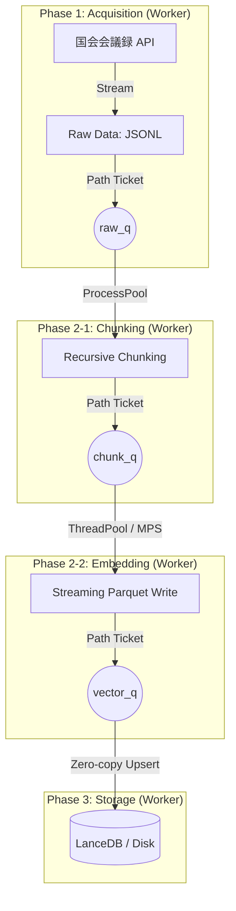
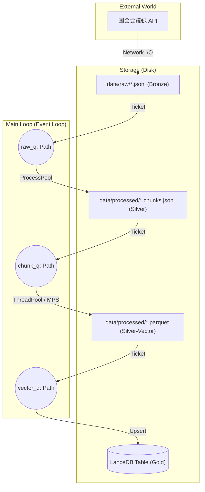

# RAG Primitive Architecture Design (STEP 1)

このドキュメントは、国会会議録 API からデータを取得し、LanceDB へ格納するまでの「理論的設計」を整理するためのものである。
「ただ動く」コードではなく、1,000万件、1億件へとスケールさせるためのシニア・データアーキテクトとしての視点を記述せよ。  
https://kokkai.ndl.go.jp/#/detail?minId=122104339X00320260312&current=1
---

## 1. 全体アーキテクチャ（System Architecture Overview）

データのライフサイクルを以下の 4 つのフェーズに分離し、**asyncio.Queue による並行ワーカー・モデル**で駆動する。

---

## 2. データ取得（Data Acquisition）の戦略
- **ソース**: 国会会議録検索システム API。
- **取得パイプライン**: 2-Stage Pipeline（API -> Raw Data Lake）を採用。
    - **[Q] なぜ API から直接ベクトル化せず、一度ローカルに保存（Raw Data Lake）するのか？**:
    - **[A]**: **耐障害性（Resilience）**と**実験の再現性（Reproducibility）**を担保するため。
        1. **リトライ効率**: ネットワーク瞬断や API レート制限発生時、取得済みデータを保護し、未取得分のみを差分取得（Checkpointing）可能にする。
        2. **試行錯誤の高速化**: エンベッディングモデルの変更やチャンキング戦略の微調整（Hyperparameter Tuning）の際、高コストなネットワーク I/O を排除し、ローカル I/O のみで高速に再実験を回すため。
        3. **スキーマの進化（Schema Evolution）**: 後から「発言者の政党情報をフィルタリングに加えたい」等の要件が出た際、API を叩き直さずに Raw データからメタデータを再抽出するため。
- **データ構造の階層化**:
    - `Meeting` ＞ `Speech` ＞ `Chunk`
    - **[Q] 数万文字を超える「極端に長い発言（Outlier）」に対するガードレール設計は？**:
    - **[A]**: **再帰的チャンキング（Recursive Chunking）**と**メモリバッファの制限**で対応。
        1. **モデル制約**: 多くのローカルモデル（BERT系）は 512 トークン程度の入力制限がある。長文は意味の切れ目（句読点等）で分割し、複数のベクトルとして管理する。
        2. **空間計算量（OOM 対策）**: 1 発言を丸ごとメモリに載せず、ストリーミングで読み込み、一定サイズ（例: 2000文字）ごとにチャンク化してベクトル変換へ流すことで、最悪ケースのメモリ消費量を $O(1)$（定数倍）に抑える。

## 3. データパイプライン（Data Processing & Embedding）
### 「入力側で Polars を使わない」論理的根拠
データ分析の天才である Polars を、本フェーズの「エサやり」に採用しない理由は以下の 3 点にある。

1. **空間計算量 $O(1)$ の死守**: `pl.read_parquet()` は全データをメモリにロードしようとする。本システムでは Python 標準のジェネレータを用い、一度にメモリに載るデータ量を「バッチサイズ（例: 64件）」に固定し、定数倍のメモリ消費に抑える。
2. **メモリ2重持ち（Double Buffering）の回避**: Polars (Rust/Arrow) からデータを抜き出す際（`.to_list()`）、Python オブジェクトへのフルコピーが発生する。これを避けるため、最初から Python の軽量な文字列としてストリーミング供給する。
3. **計算エンジンのミスマッチ**: NLP（チャンキング/トークナイズ）は CPU、推論は GPU の仕事である。

## 4. 効率化とゼロコピー（Zero-copy Efficiency）
### 「ガッチャンコ（Column Join）」のデータフロー
メタデータ（文字列）とベクトル（数値配列）を、メモリコピーを最小限に抑えて LanceDB へ格納する。

- **Zero-copy 手順**:
    1. **Vector**: `torch.Tensor` -> `.numpy()` (Shared Memory) -> `pyarrow.FixedSizeListArray` (Wrap)。
    2. **Metadata**: Python List (Batch) -> `pyarrow.array()`。
    3. **Join**: `pyarrow.RecordBatch.from_arrays` を用い、メタデータ列とベクトル列を一つのバッチに結合。

## 5. 信頼性と耐久性（Reliability & Durability）
### べき等性（Idempotency）とチェックポイント
- **Content-based Addressing**: 各チャンクの「元データID + チャンク番号 + 内容のMD5ハッシュ」を `id` として生成する。
- **Upsert 戦略**: LanceDB の書き込み時に、この `id` をキーとして既存データを確認。再実行時の重複を排除する。

## 6. ベンチマーク指標（Benchmarking Strategy）
- **計測対象**: Latency (ms/query), Throughput (docs/sec), Recall (%), Memory Usage (MiB)。
- **比較対象**: IVFFlat vs HNSW。それぞれのインデックス構築コストと検索性能のトレードオフを定量化する。

---

## 7. シニア・アーキテクトによる批判的検討（Critical Deep Dives）
1億件スケールのシステムにおいて、机上の空論を排除するための厳格な検証項目。

### 7.1. 真の空間計算量と「隠れたメモリ」
- **[Q] 2000文字×64バッチならメモリ消費は無視できるか？**:
- **[A]**: **否。** 文字列そのもののサイズ（約256KB）は氷山の一角である。
    1. **Tokenizer Overhead**: 文字列をモデル入力用の Tensor に変換した際、`int64` 型の ID 配列や Attention Mask が生成される。512 トークン × 64 バッチ × 8 バイト (int64) = 約 256KB だが、PyTorch 内部のテンソル管理やバッファ、CUDA コンテキストの初期化で数百 MiB 単位の「固定費」が発生する。
    2. **Python Object Overhead**: Python の `list` はポインタの配列であり、各文字列オブジェクトもオーバーヘッドを持つ。1億件を扱う際、この「小さな積み重ね」が $O(N)$ で効いてこないか、ジェネレータの境界条件を厳密に管理する必要がある。

### 7.2. バッチサイズ（Batch Size）の論理的最適化
- **[Q] なぜバッチサイズは「64」なのか？**:
- **[A]**: **スループット（Throughput）とレイテンシ（Latency）のトレードオフ**である。
    - **スループット優先（Batch 256+）**: GPU の並列演算ユニット（CUDA Core / Tensor Core）を使い切るため、大きなバッチを組む。ただし、GPU VRAM への転送待ち（I/O Bound）が発生し、1バッチあたりの処理時間は長くなる。
    - **レイテンシ優先（Batch 1-8）**: リアルタイム性は高いが、GPU の利用効率が悪く、1億件の処理完了（Total Job Completion Time）が絶望的に遅くなる。
    - **最適解**: ローカルの GPU/MPS メモリ帯域と演算性能を計測し、VRAM 使用率が 70-80% に収まる「スイートスポット」を実験的に決定する。

### 7.3. 分散システムとしての「背圧（Backpressure）」制御
- **[Q] データの供給（API/Disk）と消費（GPU）の速度差をどう制御するか？**:
- **[A]**: **asyncio.Queue による Explicit Backpressure** を活用。
    - 以前は Generator による Pull 型制御を検討したが、1億件スケールではワーカー間の結合度を下げるため、明示的なキューを採用した。
    - 各キューに `maxsize` を設定することで、後段の処理が遅延した際に前段を一時停止させ、メモリ上の未処理データが $O(N)$ で膨らむのを防ぐ。

### 7.5. なぜ JSON ではなく JSONL を採用するのか
- **[Q] Data Lake のフォーマットとして JSONL を選ぶ論理的根拠は？**:
- **[A]**: **空間計算量 $O(1)$ の担保と耐障害性（データ保護）**にある。
    1. **Streaming Friendly (標準ライブラリの制約)**: 通常の JSON 配列（`[...]`）をパースする場合、Python 標準の `json` ライブラリはファイル全体を一度メモリにロードして木構造を構築する必要がある。100GB の JSON は 100GB 以上のメモリを要求するが、JSONL (JSON Lines) は `readline()` で 1 行ずつ独立してパース可能なため、メモリ消費を一定に保てる。
    2. **Atomic Append (破壊的更新の回避)**: JSONL は単なる EOF への「行追記」であり、追記中に失敗しても「それ以前の行」は完全に有効な JSON として保護される。

### 7.10. メモリレイアウトと物理データフロー (CPU vs. GPU)
- **[Q] データは物理的にどこを通り、どこでコピーが発生しているか？**:
- **[A]**: **Claim Check Pattern** による「パス渡し」を基本とする。

1. **物理的コピー**: CPU (RAM) と GPU (VRAM) の間での転送。
2. **ゼロコピー / メモリ共有**: CPU メモリ内での `Torch -> NumPy -> PyArrow` の遷移。実データ（バイト列）を複製せず、メタデータ（View）のみを書き換えることで、メモリパンクを回避する。

### 7.11. バッチ処理と増分書き出し（Incremental Append）
- **[Q] 1億件スケールにおいて、メモリ常駐を避けつつ Parquet を作成するには？**:
- **[A]**: **pyarrow.parquet.ParquetWriter によるストリーミング書き出し** を実装済み。
    1. **かつての課題**: 以前はファイル全体の終了まで全ベクトルをメモリ（`np.vstack`）に保持していたが、これはバッチサイズを上げると OOM を招く $O(N)$ の設計であった。
    2. **現在の解決策**: `ParquetWriter` を用い、`BATCH_SIZE`（例: 64）ごとにディスクへ書き出し、メモリを即座に解放する。これにより空間計算量を $O(B)$ に固定し、理論上無限のデータ量を一定のメモリで処理可能となった。

### 7.13. 1億件スケールにおける IVF-PQ インデックスの必然性
- **[Q] なぜ HNSW ではなく IVF-PQ を検討するのか？**:
- **[A]**: **インデックス自体のメモリフットプリントを $O(1)$ または $O(\sqrt{N})$ に抑えるため**である。
    1. **HNSW の限界**: 全ノードのグラフ構造を RAM 上に保持する必要がある。1億件では数百 GB の RAM を消費する。
    2. **IVF-PQ (On-Disk Index)**: 
        - **IVF (Inverted File)**: ベクトル空間をクラスチャに分割し、検索時に不要なページをスキャンの対象から除外する。
        - **PQ (Product Quantization)**: 浮動小数点ベクトルを量子化（圧縮）し、ディスク上の Arrow スキャンを高速化する。

### 7.15. ベクトルバッチングと「独演会（Blocking）」の回避
- **[Q] Embedding や DB 書き込み中にイベントループが止まるのをどう防ぐか？**:
- **[A]**: **loop.run_in_executor による同期処理の隔離**。
    1. **居座り犯の正体**: `embedder.encode()` や `LanceDB.upsert()` は、GPU 待ちや I/O 待ちの間、Python スレッドを占有し、イベントループの司会進行を止めてしまう。
    2. **処方箋**: これらを `async` でない普通の関数として定義し、`ThreadPoolExecutor`（スレッドプール）に投げ飛ばす。これにより、重い計算や書き込みが行われている間も、イベントループは他のワーカー（API取得等）を動かし続けることができ、真のストリーミングが実現される。
